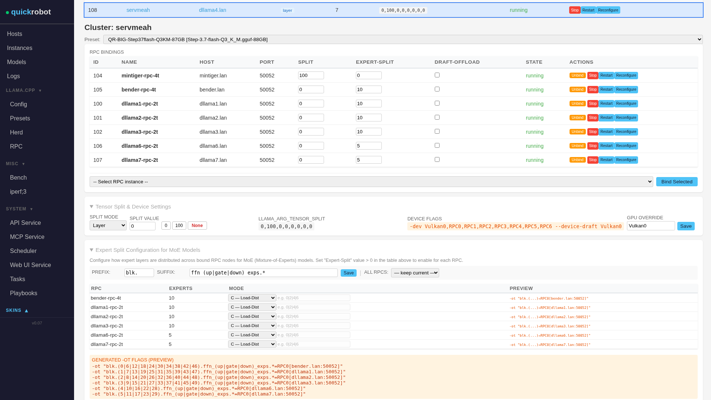
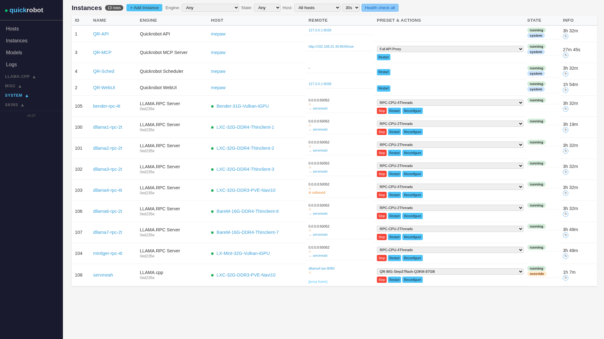
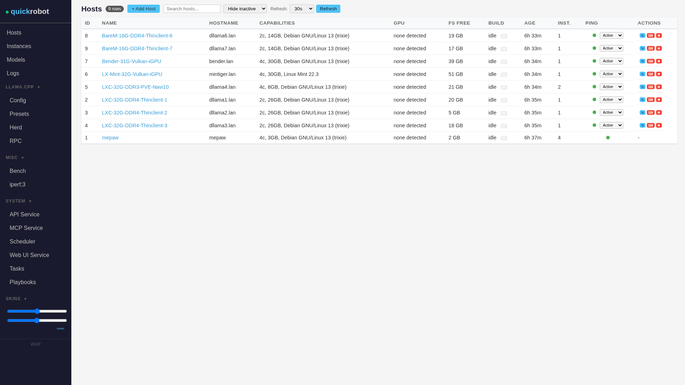

- Fully agentic backend handling for ya Llama.cpp - or anything else
- AI²-Cluster setup for RPC + GPU + Layer- + Tensor- + Expert-split + MTP 
- Model and Preset managment, Benchmark interface
- Remote Host control for agents using ansible playbooks instead of full ssh 
- Human interface Web-UI, REST-API or MCP for agents
- 100% Coded by local Qwen3.6-35B-A3B-Q5KM at 30 t/s 
- no npm, no aur, no dockerhub, no pipe to bash
- open source, open weights, closed ai

8k Trailer VIDEO here ;o)

Example Quickrobot prompt:

"Start quickrobot. Add 3 nodes (Hostnames dllama1/2/3.lan). 
On each node create an RPC instance using preset CPU-2Threads. 
On dllama1 also create a llama_server instance using preset QR-DESIGNER... 
Bind all 3 RPCs to the server. Reconfigure the server so it picks up the new RPC bindings and restart it. 
Run the "Count-to-100" benchmark and report results."

## Cluster Example: 94,5GB Model on 12GB RTX 4070ti using CUDA + Draft-MTP on 8GB Radeon using Vulkan + Experts on 2015 4c CPUs in thin clients 
4 Nodes / 2 actual GPUs / 2G5LAN / 94,5 GB on Disk - Step-3.7-flash-Q3_K_M + Q8_0 MTP / n_ctx = 262144 (Q8/Q8) 

| ID | CPU | Cores | RAM | GPU | Instance | Usage |
|----|-----|-------|-----|-----|----------|--------------------|
| 1 | Ryzen 9 3900XT | 12 ~4Ghz | 4x16GB @ DDR4-3200 | RTX4070ti 12GB 8x4.0 | Server | CUDA0: 3.3GB Attn + KV 6.5GB CPU: 34GB experts + 4GB mmproj-f16 + Browser |
| 2 | 2015 i5-6500T | 4 ~3GHz | 2x16GB @ DDR4-2400 | intel onboard HD530 | RPC0-CPU | 26GB experts |
| 3 | 2015 i5-6500T | 4 ~3GHz | 2x16GB @ DDR4-2400 | intel onboard HD530 | RPC1-CPU | 26GB experts |
| 4 | 2013 i5-4570  | 4 ~3GHz | 4x8GB  @ DDR3-1333 | 2019 AMD 8GB RX5700 | RPC2-VULKAN | 3GB -mtp-Q8_0 |

198B at ~5 t/s - not fast - But it's a good story writer 

## Cluster Example: Expert-Split on E-waste 
Nodes (1 main + 2 RPC)

| ID | CPU | Cores | RAM | GPU | Instance | Usage |
|----|-----|-------|-----|-----|----------|--------------------|
| 1 | 2013 i5-4570  | 4 ~3GHz | 4x8GB  @ DDR3-1333 | 2019 AMD 8GB RX5700 | Server | Vulkan0 = Attention+MTP+kV |
| 2 | 2015 i5-6500T | 4 ~3GHz | 2x16GB @ DDR4-2400 | intel onboard HD530 | RPC0-CPU | 8GB experts |
| 3 | 2015 i5-6500T | 4 ~3GHz | 2x16GB @ DDR4-2400 | intel onboard HD530 | RPC1-CPU | 8GB experts |

Model Qwen3.6-35B-A3B-MTP-Q5_K_M.gguf ~ 23GB  CTX_SIZE=262144   ~ 10t/s

## Cluster Example: Layer + MTP + Expert split on 1GB LAN 

## "Security":

- NO API KEYS, NO SSL, NO mTLS, NO VPN, Insecure proxy mode, Insecure static CORS settings, No LXC, No Docker, No KxS - bring your own container, VM or airgap!
- Run Agent Harness's console and the (API) server as different users for seperation.
- REMOTE LLama.cpp SERVERS BIND TO 0.0.0.0 by default - Needs Custom per Instance override to local (v/Vx/LAN ipv4/6) and "re-deploy" - but I added warning Label in Ape interface - should be fine^^  
- TODO: non-dev-flask server for http(S) + proxy functionality if needed 
- TODO: randomize API key on server deployment and use for proxy and API interactions

## BUT WHY?

- Scope of the project is to help upcycle e-waste Hardware: Too old to run win 11 ? Make it an AI-node and hold some Experts. 
- Use Your old laptop with the broken screen to store Your active context window at home on Your DDR4.

## including Human interface
In case the agent is down:

Dynamic Cluster setup for IP, Port, Layer, ENV, cli 

Remote Service handling, health checks (async), ping checks

Host management (rebuild/update/upgrade/reboot)

Local Model manager with auto-import, Change notification,
Draft (MTP) Model handling for standalone draft heads, 
Model and Preset based Merge chain for ENV or cli
TODO wrapper for downloader with checksums

## "Get started" 

Currently llama.cpp deployment is limited to git builds per node from scratch, binary downloads will follow later. (apt)   

WIP

WIP

