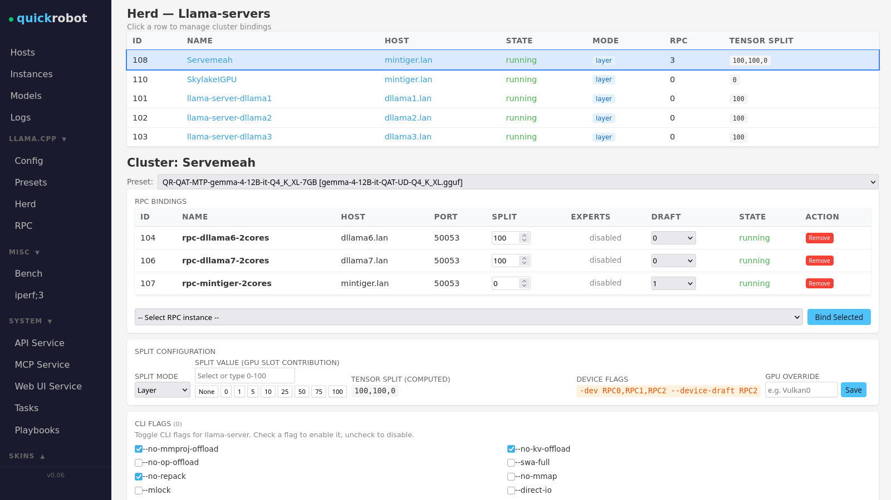
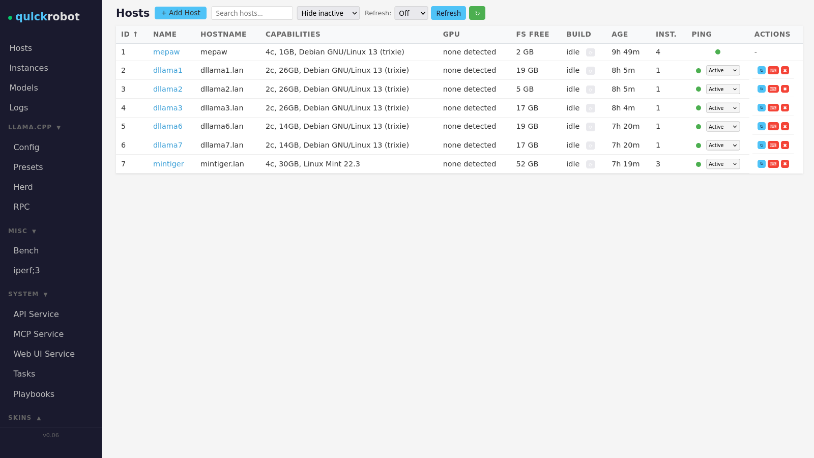
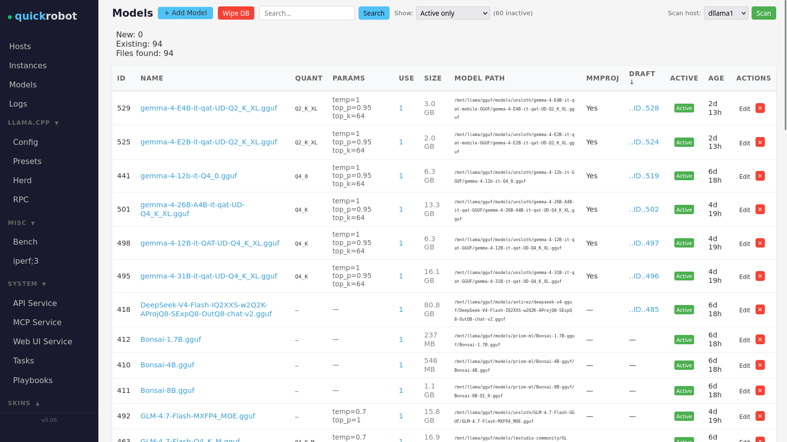

just another slob RCE for your agentic needs: 

- quickrobot is a small home-LAN controller framework for Your lab's bots and humans!
- Scope of the project is to help upcycle e-waste Hardware: Can't run win 11 ? Load the Experts of a 120B LLM instead.
- open source, open weights, closed ai
- screenshots show the human interface 

Agent harness: allow: curl -> API -> playbook -> local/remote systemd service
chat LLM: MCP SSE read only/rw  -> API -> subprocess spawn -> doom.exe
Monkey -> colorful Web-Ui http  -> API -> Llama.cpp Presets/Model/Cluster setup -> chat LLM  

- Use Your old laptop with the broken screen to store Your active context window at home on DDR4 - on Your hardware
- 100% Coded by local ai ... who whould go for less nowadays ? 
- Coder Model: Qwen3.6-35B-A3B-Q5KM - single RTX4070 - THANKS QWEN! 
- Found a bug? Want a feature added RIGHT NOW? -> load model -> and tell Your agent of choice...

#WARNING: ONLY snakeoil Security: 
- NO API KEYS, NO SSL, NO mTLS, NO VPN, Insecure proxy mode, Insecure static CORS settings, No LXC, No Docker, No KxS - bring your own container, VM or airgap!
- currently http DEV server for flask, will need stable server: binds 3 http ports (API+WebUI+MCP) USUALLY on 127.0.0.1 - see .quickrobot.env 
- Run your Agent Harness's console and the (API) server as different users for seperation.
- REMOTE LLama.cpp SERVERS BIND TO 0.0.0.0 by default - Needs Custom per Instance override to local (v/Vx/LAN ipv4/6) and "re-deploy" - but I added warning Label in Ape interface - should be fine^^  
- Checksum checks for playbooks: "--mode dev" alert on checksum mismatch. in normal prod mode: killswitch for API process on playbook checksum mismatch. Bad Robot! 

quickrobot Host:
install a Debian Trixie
sudo apt install ansible-core python3-flask python3-jinja2 python3-markupsafe python3-yaml python3-psutil python3-requests python3-requests-ntlm python3-flask-cors python3-flask-socketio
optionally: sudo apt install git tmux curl jq 
optionally: for MCP use python venv or pipx or pip or Winrar to install "mcp" 
python quickrobot.py
--init creates a new DB (should only be used once ;)

Remote Hosts: (suggestion!)
needs passwordless sudo for ansible: 
push a key with ssh-copy-id 
use visudo to add

iamauser ALL=(ALL) NOPASSWD: ALL

TODOS/knownBugs:
- I will upload some prompts + example use cases 
- add ssh != 22 
- non-dev-flask server for http(S) + proxy functionality if needed 
- Add "binary download" option for llama.cpp deploys - currently all nodes compile own versions which allows for different git repos per host/instance-override or different build options
- canvas mode + more default engines...vllm,Ollama,TTS,STT...
- randomize API key on server deployment and use for proxy and API interactions
- Groups/Favs for Dashboard display
- Burst bubble, Fix planet, 
- killswitch extension with hash check for systemprompts, playbook helpers, python files, models, runtimes, selfcheck, add 3 or 4 more rules...
- DB/log cleanup - currently no limit on disk size usage! 
- let me know
