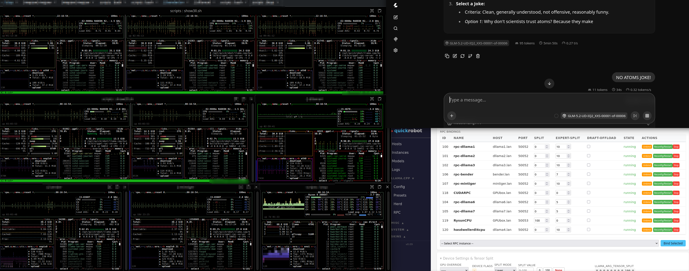
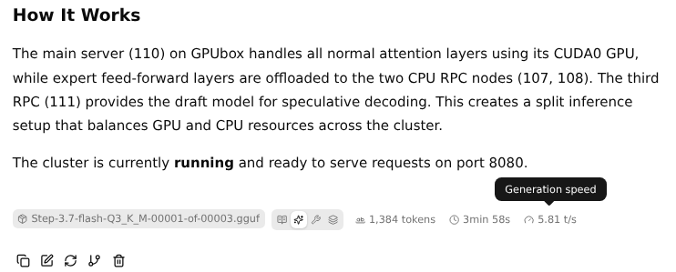
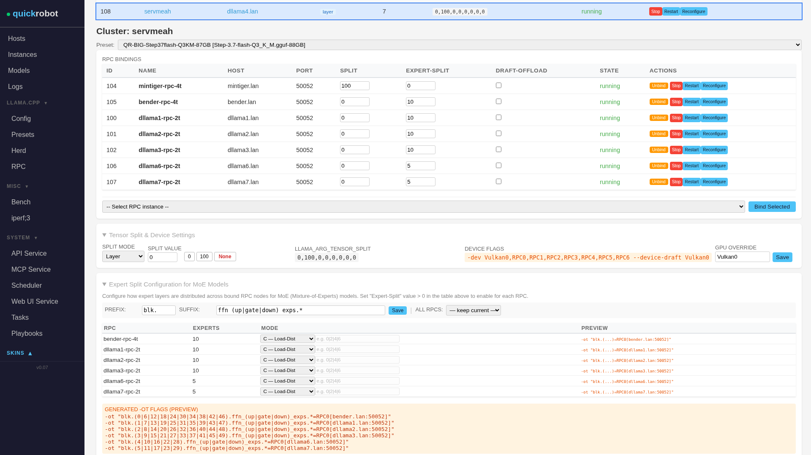
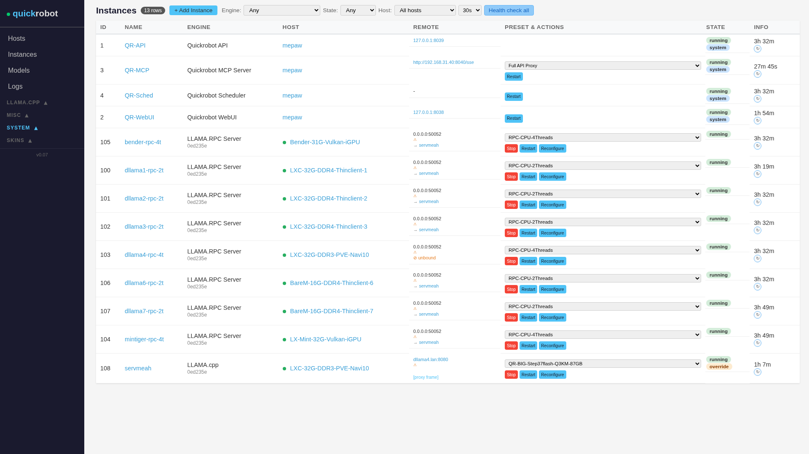
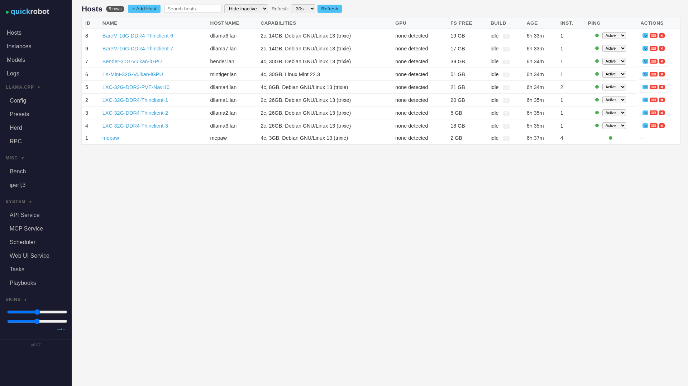
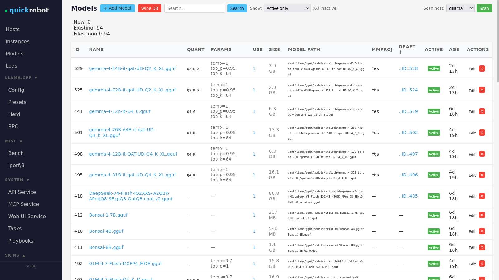

WIP

- Fully agentic backend handling for ya Llama.cpp lab - or anything else
- Ape or AI-driven Cluster setup for RPC + GPU + Layer- + Tensor- + Expert-split + MTP 
- Model and Preset handling
- Remote Host control for agents using ansible playbooks instead of full ssh 
- Human backwards compatible Web-UI interface, REST-API or MCP for agents
- 100% Coded by local Qwen3.6-35B-A3B-Q5KM at 30 t/s - extend it as needed - no bigger model needed
- no npm, no aur, no dockerhub, no pipe to bash
- open source, open weights, closed ai

8k Trailer VIDEO goes here ;o)


## Cluster Example: 222GB Model GLM 5.2 on the 5x 6W TDP thin clients and some other e-waste





Example Quickrobot prompt:

"Start quickrobot server. Add 3 nodes (Hostnames node1.lan, node2.lan, node3.lan). 
On each node create an RPC instance. 
On node1 also create a llama_server instance using preset QR-DESIGNER... 
Bind all RPCs to the server. Run the "Count-to-100" benchmark and report results."

## Cluster Example: 94,5GB Model on 12GB RTX 4070ti using CUDA + Draft-MTP on 8GB Radeon using Vulkan + Experts on 2015 4c CPUs in thin clients 
4 Nodes / 2 actual GPUs / 2G5LAN / 94,5 GB on Disk - Step-3.7-flash-Q3_K_M + Q8_0 MTP / n_ctx = 262144 (Q8/Q8) 

| ID | CPU | Cores | RAM | GPU | Instance | Usage |
|----|-----|-------|-----|-----|----------|--------------------|
| 1 | Ryzen 9 3900XT | 12 ~4Ghz | 4x16GB @ DDR4-3200 | RTX4070ti 12GB 8x4.0 | Server | CUDA0: 3.3GB Attn + KV 6.5GB CPU: 34GB experts + 4GB mmproj-f16 + Browser |
| 2 | 2015 i5-6500T | 4 ~3GHz | 2x16GB @ DDR4-2400 | intel onboard HD530 | RPC0-CPU | 26GB experts |
| 3 | 2015 i5-6500T | 4 ~3GHz | 2x16GB @ DDR4-2400 | intel onboard HD530 | RPC1-CPU | 26GB experts |
| 4 | 2013 i5-4570  | 4 ~3GHz | 4x8GB  @ DDR3-1333 | 2019 AMD 8GB RX5700 | RPC2-VULKAN | 3GB -mtp-Q8_0 |



198B at ~5 t/s - not fast - But it's a good story writer 

## Cluster Example: Expert-Split on E-waste 
Nodes (1 main + 2 RPC)

| ID | CPU | Cores | RAM | GPU | Instance | Usage |
|----|-----|-------|-----|-----|----------|--------------------|
| 1 | 2013 i5-4570  | 4 ~3GHz | 4x8GB  @ DDR3-1333 | 2019 AMD 8GB RX5700 | Server | Vulkan0 = Attention+MTP+kV |
| 2 | 2015 i5-6500T | 4 ~3GHz | 2x16GB @ DDR4-2400 | intel onboard HD530 | RPC0-CPU | 8GB experts |
| 3 | 2015 i5-6500T | 4 ~3GHz | 2x16GB @ DDR4-2400 | intel onboard HD530 | RPC1-CPU | 8GB experts |

Model Qwen3.6-35B-A3B-MTP-Q5_K_M.gguf ~ 23GB  CTX_SIZE=262144   ~ 10t/s


## Cluster Example: Layer + MTP + Expert split on 1GB LAN 


## "Security":

- no TLS/HTTPS by default currently
- API key (`QUICKROBOT_API_KEY`) on all `/api/v1/*` routes
- WebUI password login (`QUICKROBOT_WEBUI_PASSWORD`), rate-limited with failed-attempt logging
- MCP auth via same `QUICKROBOT_API_KEY` token- plain HTTP by default (future HTTPS)
- REMOTE LLama.cpp SERVERS BIND TO 0.0.0.0 by default - Needs Custom per Instance override to local (v/Vx/LAN ipv4/6) and "re-deploy"   
- Run Agent Harness's console and the (API) server as different users for seperation.


## BUT WHY?

- Scope of the project is to help upcycle e-waste Hardware: Too old to run win 11 ? Make it an AI-node and hold some Experts. 
- Use Your old laptop with the broken screen to store Your active context window or some Experts at home on Your DDR4.

## including Human interface
In case the agent is down:


Dynamic Cluster setup for IP, Port, Layer, ENV, cli 


Remote Service handling, health checks (async), ping checks


Host management (rebuild/update/upgrade/reboot)


Local Model manager with auto-import, Change notification,
Draft (MTP) Model handling for standalone draft heads, 
Model and Preset based Merge chain for ENV or cli
TODO wrapper for downloader with checksums


## Architecture

```
┌──────────┐     ┌──────────┐     ┌──────────┐     ┌──────────┐
│ WebUI    │     │ MCP      │     │ Scheduler│     │ User CLI │
│ (:8038)  │     │ (:8040)  │     │ (subproc)│     │ (curl)   │
└────┬─────┘     └────┬─────┘     └────┬─────┘     └────┬─────┘
     │                │                │                │
     ▼                ▼                ▼                ▼
┌──────────────────────────────────────────────────────────────┐
│                     API Server (:8039)                       │
│  Flask REST API + subprocess manager + orchestrator          │
│  Routes → engine dispatch → playbook runner → remote nodes   │
└───────────────────────┬──────────────────────────────────────┘
                        │ (SSH + Ansible)
                        ▼
              ┌───────────────────────┐
              │    Remote Nodes       │
              │  ┌──────┐ ┌──────┐    │
              │  │RPC0  │ │RPC1  │    │
              │  │gRPC  │ │gRPC  │    │
              │  └──┬───┘ └──┬───┘    │
              │     └────┬───┘        │
              │  ┌───────┴───────┐    │
              │  │ llama_server  │    │
              │  │ (model loaded)│    │
              │  └───────────────┘    │
              └───────────────────────┘
```

**Deployment Stages** (llama_server/llama_rpc):
`preflight` → `deps` → `source` (git clone) → `compile` (cmake, up to 30min) → `config_svc` (systemd unit) → `config_env` (env file, `$QR_CLI_ARGS_JOINED`) → `start` (service + health probe)

## Configuration

Network configuration is defined in `.quickrobot.env` (human-edited, read-only by the server):

| Key | Default | Purpose |
|-----|---------|---------|
| `QUICKROBOT_API_HOST` / `PORT` | `127.0.0.1` / `8039` | API server bind address |
| `QUICKROBOT_WEBUI_HOST` / `PORT` | `127.0.0.1` / `8038` | WebUI bind address |
| `QUICKROBOT_MCP_HOST` / `PORT` | `127.0.0.1` / `8040` | MCP server bind address |
| `*_AUTOSTART` flags | `true` | Auto-start WebUI/MCP/Scheduler on API boot |

## "Get started" 

WIP

... see requirements.txt

# First run

```
python3 ./quickrobot.py
============================================================
[qr] Fresh setup detected — generated new .quickrobot.env
============================================================
[qr] WebUI password: OIcESNg6TsRkSzkMkjZFtywcPFkWcSbh
[qr] API key:        QEOmrxniOO9_PfKayKnS3pSiE-bGMc6UK9btgSS4oSM
[qr] File created:   /temp/quickrobot/.quickrobot.env
[qr] Restart quickrobot to create fresh DB with seed data.
============================================================


python3 ./quickrobot.py
[qr] 17:53:14 main() starting
[qr] 17:53:14 pre-flight stale check starting
[qr] 17:53:14 importing app/routes
[qr] 17:53:14 imported app/routes
[qr] 17:53:14 calling run_startup
[qr] v0.11 — Quickrobot API server starting...
[qr] Backing up existing database before startup
[qr] Database backed up to /temp/quickrobot/data/_backups/qr_backup_20260726_175314.db
[qr] Engine registry loaded
[qr] localhost node OK: name=localhost, hostname=Blablubblabla
Updated system-managed instance QR-API (ID 1)
Updated system-managed instance QR-WebUI (ID 2)
Updated system-managed instance QR-MCP (ID 3)
Updated system-managed instance QR-Sched (ID 4)
[qr] Instance ID range: system=1-99, user>=100
[qr] Pre-flight: all ports and processes clear
[qr] host ping started (interval=120s)
[qr] 17:53:14 run_startup returned
[qr] quickrobot API server starting on http://127.0.0.1:8039
[qr] version=v0.11 mode=prod
[qr] 17:53:14 starting waitress.serve
[qr] starting waitress.serve()
[qr] ENV: subprocess env reduced 127 → 16 keys (whitelist)
[qr] [WEBUI] auto-start: Quickrobot Webui at http://127.0.0.1:8038/webui/  pid=540300  api=127.0.0.1:8039
[qr] Quickrobot Mcp start failed: mcp package not installed. Run: pipx install mcp or pip install mcp
[qr] [SCHEDULER] auto-start: Quickrobot Scheduler at N/A (background process, no network endpoint)  pid=540308  api=127.0.0.1:8039
```
open http://127.0.0.1:8038/webui/ in Browser 


Currently llama.cpp deployment is limited to git builds per node from scratch, binary downloads will follow later. (apt)   

